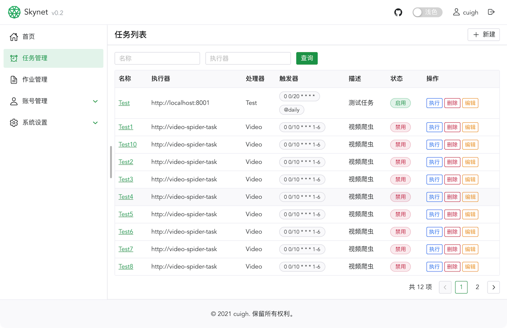
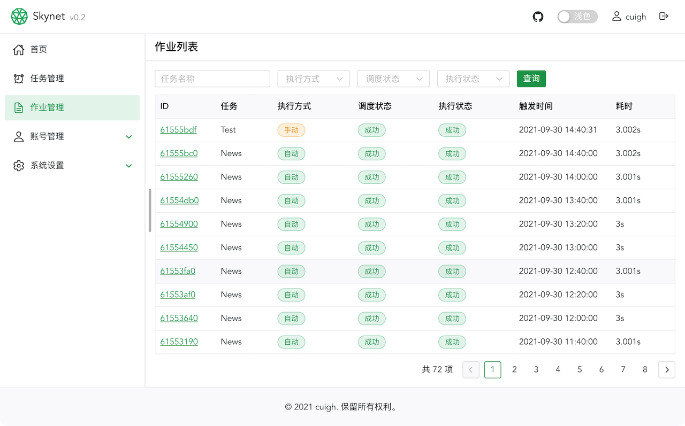

# Skynet

Skynet 是一个分布式任务调度系统。跟其它已有的任务调度系统相比，Skynet具有以下特性:

* 高性能，单集群可以轻松管理数十万任务的调度
* 高可用，只需要两个节点即可实现高可用，且可靠性会随着节点数的增加而提升
* 部署简单，默认部署方式只依赖 MongoDB 数据库
* 支持多种方式报警，如邮件、企业微信等
* 支持通过 API 远程手动触发任务

## 系统架构

Skynet 由调度器、执行器、处理器、分布式锁、解析器等组件构成，系统架构图如下：



|  组件   | 说明  |
|  ----  | ----  |
| 调度器  | 调度器即 Skynet 应用本身，它负责控制任务在指定时间执行 |
| 执行器  | 执行器是处理器的宿主应用，它负责跟调度器进行通讯，应该运行多个执行器实例以保证高可用 |
| 处理器  | 处理器是每个任务的业务处理逻辑 |
| 分布式锁  | 集群模式下，Skynet 实例依赖分布式锁来防止任务重复调度 |
| 解析器  | 解析器负责对执行器的地址进行解析 |
| 存储器  | 存储 Skynet 系统自身数据以及任务、作业等数据 |

## 界面

### 任务管理



### 作业管理



## 安装

可以通过多种方法来安装 Skynet。

### Docker(推荐)

```shell
docker run -e DB_MONGO_SKYNET_ADDRESS=mongodb://localhost:27017/skynet --name skynet -it -p 8001:8001 cuigh/skynet
```

### 手动编译

```shell
go install github.com/cuigh/skynet
```

编译后修改 app.yml 中的数据库地址，直接运行即可

```shell
skynet -config /etc/skynet/app.yml
```

### 预编译二进制文件(TODO)

## 执行器(Runner)

Skynet 中已经包含了一个简单的执行器服务骨架，基于它可以轻松的开发一个执行器（其它语言也可以参考其实现），示例代码如下：

```go
package main

import (
	"github.com/cuigh/auxo/app"
	"github.com/cuigh/auxo/app/flag"
	"github.com/cuigh/auxo/net/web"
	"github.com/cuigh/auxo/net/web/filter"
	"github.com/cuigh/skynet/runner"
)

func main() {
	app.Name = "skynet-runner"
	app.Version = "0.1"
	app.Desc = "A test runner for Skynet"
	app.Flags.Register(flag.All)
	app.Action = func(ctx *app.Context) error {
		app.Run(createWebServer())
		return nil
	}
	app.Start()
}

func createWebServer() *web.Server {
	ws := web.Default(":8002")
	ws.Use(filter.NewRecover())
	ws.Post("/task/execute", runner.HandleExecute)
	return ws
}

func init() {
	// register handlers
	runner.RegisterFunc("Test1", func(job *contract.Job) error {
		print(job.Task, job.Id)
		return nil
	})
	runner.RegisterFunc("Test2", func(job *contract.Job) error {
		print(job.Task, job.Id)
		return nil
	})
}
```

## TODO

* 多语言支持
* 支持更多报警方式，如钉钉、Slack等
* 远程调用 Token 管理
* 支持将任务拆分成多个子任务并发执行